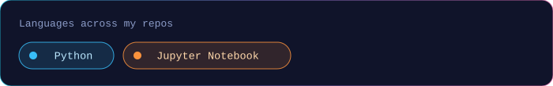

## Hi, I'm Sai Vardhan 👋

I started as a Java full-stack engineer and now spend most of my time putting AI into real applications: chatbots, agents and the integrations that connect them to the systems people already use. I also help modernize existing apps, which is less flashy and usually more useful.

 Another late one — headphones on, RGB humming, one more service to ship before bed.

  

| 🧰 Day to day | 🏅 Certified | 💬 Ask me about |
| --- | --- | --- |
| Full-stack apps AI chatbots and agents Application modernization | AWS Machine Learning Engineer – Associate Databricks Generative AI Engineer Associate | Java and AI integrations Agents inside enterprise apps |

## Stack

| Backend and full-stack | AI and data | Cloud and tooling |
| --- | --- | --- |
|     |         |     |

## Things I've built

| 🧪 Prompt engineering | ☁️ Cloud |
| --- | --- |
| **[genai-sdlc-lab](https://github.com/sunnykasula/genai-sdlc-lab)** Notebooks covering zero-shot, few-shot, chain-of-thought and self-consistency prompting, plus reusable prompt templates.   | **[gcpcndproject](https://github.com/sunnykasula/gcpcndproject)** A Python web app packaged with Docker for deployment on Google Cloud.    |

## Where I've worked

| | | |
| --- | --- | --- |
| **Nationwide Insurance** | Full Stack AI Engineer | Sep 2025 – Present |
| **Inspire Brands** (via S2 IT Group) | Software Developer | Jan 2024 – Sep 2025 |
| **Accenture** | Full Stack Engineer | Jun 2022 – Jul 2023 |
| **Tata Consultancy Services** | Software Engineer | Sep 2021 – Jun 2022 |

Currently: breaking a monolithic insurance platform into Spring Boot microservices while wiring RAG-based retrieval into it.

## Certifications

## GitHub activity

 

Tests pass. Logs are quiet. Ship it.

